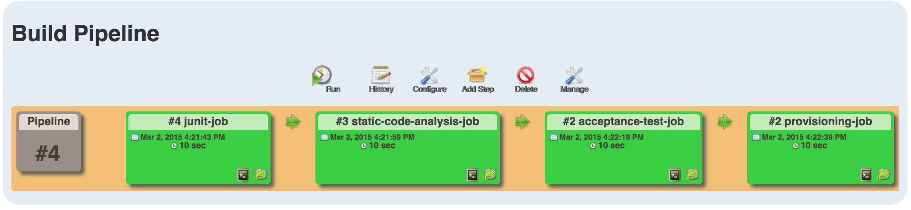
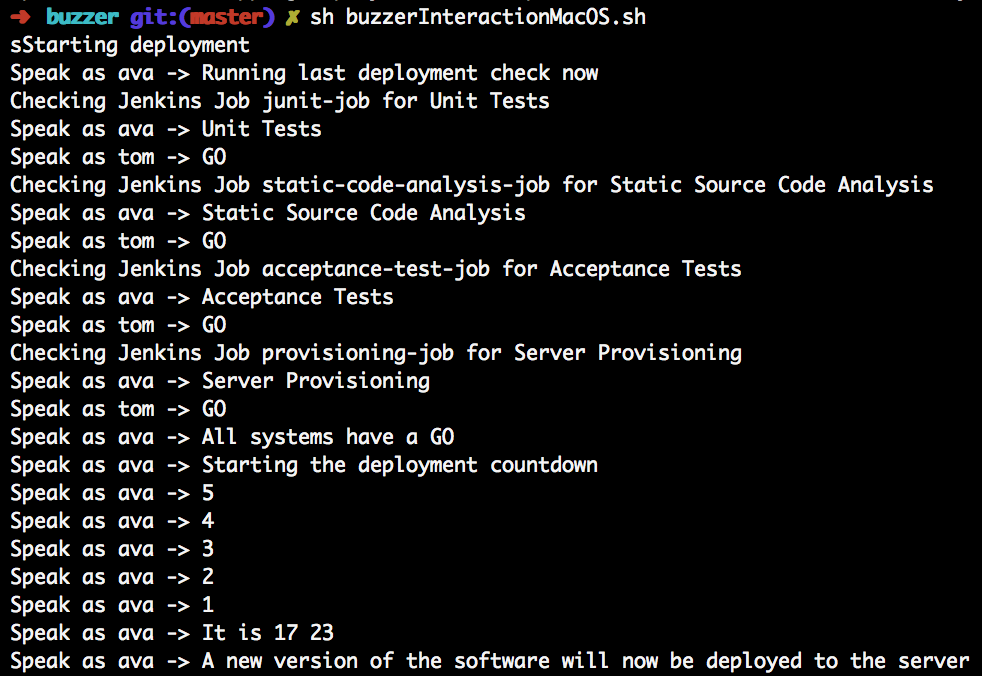
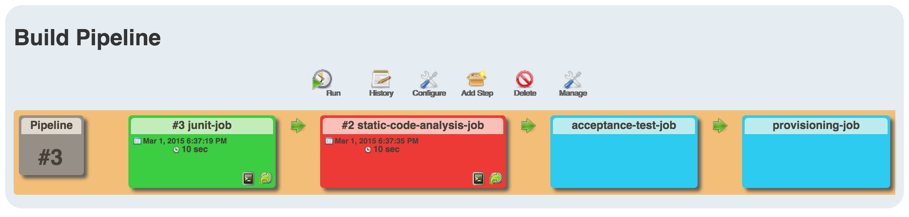
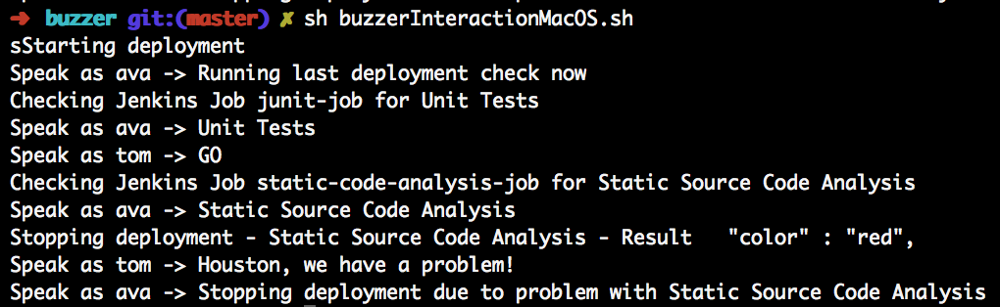

## Description
 
This script can be used together with the buzzer
from http://www.f-pro.de/buzzer to trigger 
a deployment job. The script will verify several
Build Jobs Results before triggering the deployment job.
This script is part of the Hackergarden @ JavaLand 2015
 
## Requirements
 
- MacOS X incl. voices Ava and Tom
- Jenkins as Build Server
- Buzzer, see http://www.f-pro.de/buzzer

I programmed the buzzer to react to the following keys.
 
- Start Key: s
- End Key:   e

## Screenshots

### Everything Ok

 

 

### One Step Failed

 

 